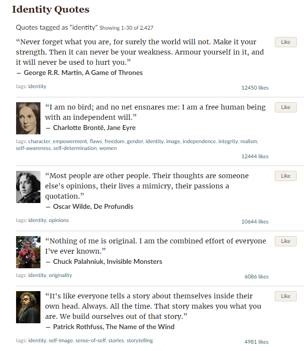
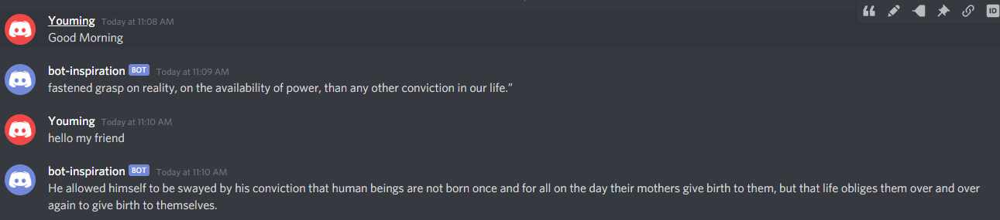
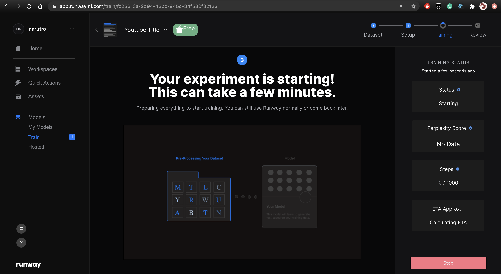

# Week 4 My Bot Firend
As we exposed more to technolog, we tend to forget who we are and how we are seen ourselves. Then I decided to created a chat bot in Discord who can talk to me in an inspriation way to remind me who I was. 
## Scraping
I started with scraping the self identification quotes form web. I used python and bs4 to scraping all the quotes from the web and stored them into a txt file. Scraping script in week4 folder.


## Training
I used the quotes I scraped to train a GPT2 in runway as the communication tool for my discord bots. It will run this model I trained and exchange message with me. 
```javascript
const model = new rw.HostedModel({
  url: "https://bot-dis-84e10ad3.hosted-models.runwayml.cloud/v1/",
  token:,
});
```
## DiscordMan 
I used discord developer applicaiton to set up a discord bot. I call it discordMan who reminds me who I truly was. When I say "Good Morning" it will run the GPT2 model and reply me with a quot came up by himself. When I say "Hello my friend" it will replay me a random quote I scraped as if he is talking to me.


# Week 3 Simulation
This week I a creating a watched youTube titles as my data and train a GPT2 to generate youtube titles. Actually the hard part is to collect the data. My data set has to be large enough to run as training set. As well as the  context of the file. I can not just use JSON file I parsed. I actually wrote a python parser to parse my json file. All the data set and code is under week3's folder. Here is some results I had when I ran the model I trained. 

I am surprised that train time for GPT is actually not that long. It took me about 20 minutes to train which is relatively fast. Here is the model I hosted:

```html
<script src="https://cdn.jsdelivr.net/npm/@runwayml/hosted-models@latest/dist/hosted-models.js"></script>
```
I also tried to type some random words and it will gave me some youTube title liked text. 

```
We we 

We weeps | Left and Right with Johny Johny | LooLoo KIDS Nursery Rhym
```
I typed We we and it returned me some text with divider "|" symbol.

```
Something is wrong

Something is wrong with Rvssian - you won't believe what he does Happy Birthday 🎉
```
I am surprised that GPT returned me some text with emoji. I remembered that I trained it with some emojis and I get some similar results.

```
Lil Joe

Lil Joe ft. Bryson Tiller - 'ETERNAL' | Type Beat | 2018
J.I. x Lil Tja
```
I typed a person's name and I got some music youTube title. 
```
🐶

🐶Three Little Kittens - LooLooKids Nursery Rhymes and Kids Songs
```
I typed a emoji and it gave me a song name. Interesting... It even kind of recognized what kind of emoji I am using even though its not that acurate.
I think more data and larger training set will make this model more accurate and readable. I guess this hard this is to access the data and manipulate and clean the data rather than training it. 


# Week 1 Obfuscation

### Assignment Goal:
Fake some online activities on YouTube since I love to watch YouTube.

This week we learn a automation tool called Puppeteer. This is a useful tool for me to create "fake" online activities. I started with simple "Hello World" for puppeteer.

```javascript
import puppeteer from 'puppeteer'

const browser = await puppeteer.launch({
    headless:false,
    slowMo: 10
});
const page = await browser.newPage();
await page.goto('https://youtube.com');
//await browser.close(); 

```
This allows me to open YouTube automatically. 

I noticed that watching YouTube is different from using social media. I don't need to login in order to watch videos. However, I want puppeteer to wait me log in then continue its actions. I found out that log in button's html id changes after logged in. I used below code to tell puppeteer to wait. 
```javascript
await page.waitForSelector('#avatar-btn');
```

I am "faking" my activities using random word generator tool. Usage is the same as puppeteer.
```
npm install random-words
```
After it watched all videos, my program will output a JSON file contains title watched and watched duration.
```javascript
[
  { title: '', watchedDuration: 2 },
  {
    title: 'State Of Emergency Declared In Louisville In Preparation For Peaceful Protests',
    watchedDuration: 2
  },
  {
    title: 'Trump shreds Dem governors pushing for mail-in voting',
    watchedDuration: 1
  },
  { title: 'Ingraham: Riot at the court', watchedDuration: 3 },
  {
    title: 'Hannity: Dems threatening entire country in order to upend SCOTUS norms',
    watchedDuration: 1
  },
  { title: 'Ingraham: Riot at the court', watchedDuration: 2 },
  {
    title: 'Hannity: Dems threatening entire country in order to upend SCOTUS norms',
    watchedDuration: 3
  },
  {
    title: 'Tucker: The left’s extreme reaction to Ginsburg’s death',
    watchedDuration: 3
  },
  {
    title: 'Tucker: President Trump wants US troops out of the Middle East',
    watchedDuration: 3
  },
  {
    title: 'Trump delivers remarks in Pennsylvania',
    watchedDuration: 1
  }
]

```
#### Some Errors Encountered:
```
waitFor is deprecated and will be removed in a future release. See https://github.com/puppeteer/puppeteer/issues/6214 for details and how to migrate your code.
```
waitFor() is deprecated? I used waitForSelector()instead. 
```
Error: Node is either not visible or not an HTMLElement
```
some await functionality? I use this fixed this error
```javascript 
wait page.evaluate(()=>{})
```
Puppeteer does not search new term again using the same logic. So I tried to click related videos instead. Need to figure out why searching new term not working. 

